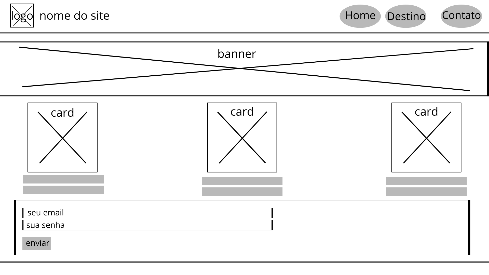

# Dados básicos:
Nome: Yudy Samuell Magalhães Ramos
Matrícula: 906627
 
## Proposta de projeto escolhida:
Lugares e Experiências - Lugar - Atividades / Eventos / Visitações

## Descrição sobre o projeto:
Este projeto apresenta o Japão e algumas de suas cidades, destacando pontos turísticos e abordando aspectos como cultura, gastronomia e o que torna cada uma delas conhecida. O site foi desenvolvido utilizando HTML, CSS e wireframe.

# Wireframe

# Home

